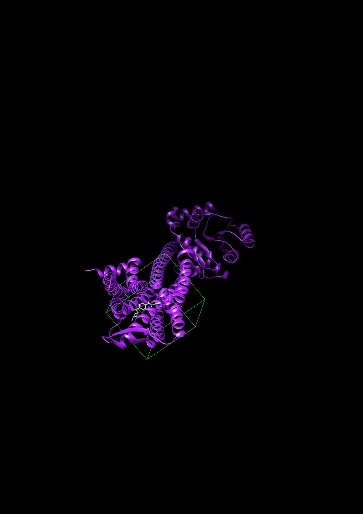

<p align="center">
  
</p>

# In Silico Identification of Novel Compounds for Insomnia Disease

**Author:** Maurizio Rafael Hernández Díaz

---

## Overview

This project implements a multi-step **virtual screening pipeline** to identify novel antagonists of the human **Orexin 2 Receptor (OX2)**, a validated pharmacological target for the non-addictive treatment of insomnia. The workflow integrates ligand-based and structure-based computational methods, validated at each step with positive and negative controls.

The lead candidate identified, **Z26441190**, achieved a binding affinity of **−10.49 kcal/mol** against the OX2 receptor and a QED score of **0.851**, making it a promising drug-like scaffold for further experimental validation.

---

## Background

Insomnia affects a significant proportion of the population and is associated with comorbid psychiatric and medical conditions. Current pharmacological treatments — primarily benzodiazepines — carry risks of addiction, tolerance, and withdrawal syndrome. Orexin receptor antagonists represent a mechanistically distinct and safer alternative, as they act by blocking the wake-promoting orexinergic system rather than non-selectively suppressing CNS activity.

---

## Pipeline Summary

The screening workflow consists of **5 sequential stages**:

```
Enamine GPCR Library (53,440 compounds)
        │
        ▼
[Step 1] Physicochemical Filtering
         - Lipinski Rule of Five
         - CNS drug-likeness (Pajouhesh & Lenz, 2005)
         - QED > 0.6 (RDKit)
        │
        ▼
[Step 2] Substructure & PAINS Filtering
         - Removal of 1,259 pan-assay interference compounds
        │
        ▼
[Step 3] Butina Clustering (diversity reduction)
         - Morgan Fingerprints + Tanimoto similarity
         - Cluster centroids selected as representatives
        │
        ▼
[Step 4] QSAR Model (Random Forest)
         - Training set: known OX2 antagonists (ChEMBL, UniProt: O43614)
         - Features: Morgan fingerprints + 2D/3D descriptors (RDKit)
         - Validation: Suvorexant (pIC₅₀ pred. 7.39), Lemborexant (7.48)
        │
        ▼
[Step 5] Pharmacophore Model
         - Built from FDA-approved OX2 drugs docked to 4S0V
         - Positive controls: SB-649868, ACT-462206 (high scores)
         - Negative controls: Lorazepam, Zolpidem (low scores)
        │
        ▼
[Step 6] Molecular Docking (AutoDock Vina / UCSF Chimera)
         - Target: PDB 4S0V (OX2 + Suvorexant co-crystal, 2.50 Å)
         - Grid: centered on Asn324 (58.856, 7.542, 55.199 Å), 25×25×25 Å
         - Redocking RMSD validation: 0.22 Å
         - Top 5 candidates scored and visually inspected
```

---

## Target

| Parameter | Value |
|-----------|-------|
| Protein | Human Orexin 2 Receptor (OX2 / HCRTR2) |
| UniProt ID | O43614 |
| PDB Entry | 4S0V |
| Resolution | 2.50 Å |
| Co-crystallized ligand | Suvorexant |
| Binding site residue (grid center) | Asn324 |

---

## Screening Library

| Parameter | Value |
|-----------|-------|
| Source | Enamine GPCR-Targeted Library |
| Initial compounds | 53,440 |
| After physicochemical filters | 43,849 |
| PAINS / undesirable removed | 1,259 |
| Final screened (cluster centroids) | Reduced diverse subset |

---

## Results

### QSAR Validation (Positive Controls)

| Compound | Predicted pIC₅₀ |
|----------|----------------|
| Suvorexant | 7.39 |
| Lemborexant | 7.48 |

### Top 5 Candidates (Docking)

| Enamine Catalog ID | Binding Affinity (kcal/mol) |
|--------------------|-----------------------------|
| **Z26441190** | **−10.49** ← Lead candidate |
| Z1155102784 | — |
| Z1840003394 | — |
| Z52198758 | — |
| Z28143004 | — |

### Lead Candidate: Z26441190

- **Binding affinity:** −10.49 kcal/mol
- **QED score:** 0.851
- **Key interactions:** dense Van der Waals contact network + hydrophobic interactions with OX2 pocket residues
- **Negative control gap:** Aspirin docked at −5.73 kcal/mol, confirming specificity

---

## Software & Tools

| Tool | Purpose |
|------|---------|
| **RDKit** | Molecular descriptors, QED, Morgan fingerprints, PAINS filtering |
| **Scikit-learn** | Random Forest QSAR model |
| **AutoDock Vina 1.2.0** | Molecular docking |
| **UCSF Chimera** | Docking setup, visual inspection (H-bonds, clashes, contacts) |
| **ChEMBL** | Training set of OX2 antagonists (UniProt: O43614) |
| **Enamine** | GPCR compound library |
| **TeachOpenCADD** | Cheminformatics workflow reference (Butina clustering) |

---

## Repository Structure

```
DVS/
├── README.md
├── requirements.txt
│
├── SCRIPTS/                                                   # Jupyter notebooks (pipeline steps)
│   ├── Step1A_OX2_chembl_compounds_retrival_ADME_propierties.ipynb   # ChEMBL retrieval & ADME filtering (training set)
│   ├── Step1B_Enamine_library_ADME_propierties_.ipynb                # Enamine library ADME filtering
│   ├── Step2_Molecular_filtering_unwanted_substructures_and_PAINS_removal.ipynb  # PAINS & substructure removal
│   ├── Step3_Compound_Clustering-2.ipynb                             # Butina clustering & centroid selection
│   ├── Step4_QSAR_model.ipynb                                        # Random Forest QSAR model
│   └── Step5_Pharmacophore-3.ipynb                                   # Pharmacophore model & scoring
│
├── DATA/                                                      # Input & intermediate data files
│   ├── ENAMINE.csv                                            # Raw Enamine GPCR library (53,440 cpds)
│   ├── Enamine_curated_database.csv                           # After ADME/physicochemical filtering
│   ├── Enamine_dataset_clean.csv                              # After PAINS removal
│   ├── Enamine_representative_set.csv                         # Cluster centroids (diversity-reduced)
│   ├── OX2_receptor_chembl_curated_database_definitive.csv   # Curated ChEMBL OX2 training set
│   ├── QSAR_BEST_HITS.csv                                     # Top compounds by predicted pIC₅₀
│   ├── BEST_HITS_TO_DOCK.csv                                  # Final 5 candidates passed to docking
│   ├── filtros_brenk_final.tsv                                # Brenk unwanted substructure filters
│   └── pharmacophore_features.mol2                            # Exported pharmacophore model
│
├── FIGURES/                                                   # All figures (generated by notebooks)
│   ├── COVER.png                                              # Cover image
│   ├── Figure1.png                                            # Pharmacophore validation results
│   ├── Figure2.png                                            # Top 5 candidate molecules (2D structures)
│   ├── Figure3.png                                            # Suvorexant redocking (RMSD = 0.22 Å)
│   ├── Figure4.png                                            # Z26441190 pose in OX2 binding pocket
│   ├── Figure5.png                                            # Z26441190 interaction map (2D)
│   └── Figure6.png                                            # Full docking results table
│
└── MANUSCRIPT/
    └── MANUSCRIPT.pdf                                         # Full manuscript (compiled)
```

---

## Key References

- Yin et al. (2015). Crystal structure of human OX2 bound to suvorexant. *Nature*, 519, 247–250.
- Eberhardt et al. (2021). AutoDock Vina 1.2.0. *J. Chem. Inf. Model.*, 61, 3891–3898.
- Bickerton et al. (2012). Quantifying the chemical beauty of drugs. *Nature Chemistry*, 4, 90–98.
- Pajouhesh & Lenz (2005). Medicinal chemical properties of successful CNS drugs. *Neurotherapeutics*, 2, 541–553.
- Sydow et al. (2022). TeachOpenCADD 2022. *Nucleic Acids Research*, 50, W753–W760.
- Zdrazil et al. (2024). The ChEMBL Database in 2024. *Nucleic Acids Research*, 52, D1180–D1192.

---

## Future Directions

Subsequent **in vitro** binding assays and functional studies for Z26441190 are required to confirm its OX2 antagonistic activity and safety profile before progression to preclinical development.

---

> *This work was conducted entirely in silico. All results are computational predictions pending experimental validation.*
